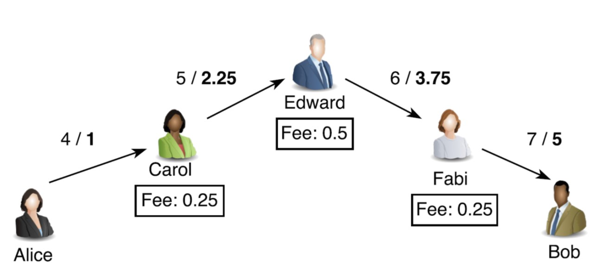
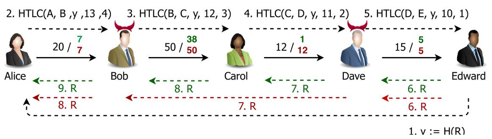

# An Anti-Wormhole Payment Channel Network on Bytom

A payment channel network daemon based on Bytom using Path Hashed Time Locked Contract (PHTLC) instead of Hashed Time Locked Contract (HTLC), which is robust against wormhole attack.

## Introduction

A payment channel is a two-party off-chain protocol, by which multiple micropayment can be performed between two given on-chain nodes instatntly. A payment channel network is a multi-party off-chain protocol to perform payment between any two on-chain nodes by utilizing multiple existing payment channels as long as there exists at least one path connecting the two nodes.

### Hashed Time Locked Contract (HTLC)

Assume a collision-resistant hash function `H()` and the condition `R` is chosen uniformly.
`HTLC (Alice, Bob, y, x, t)` is defined as:
- If Bob produces the condition `R` such that `H(R) = y` before `t` days, Alice pays Bob `x` bitcoins.
- If `t` days elapse, Alice gets back `x` bitcoins.

### Payment Channel Networks (PCNs)

### Wormhole Attack in PCNs

The wormhole attack in PCNs is first analyzed formally by [MMSK18](https://eprint.iacr.org/2018/472.pdf), in which the authors using a novel cryptographic primitive -- anonymous multi-hop locks (AMHLs) to address this problem.

## Path Hashed Time Locked Contract (PHTLC) Scheme

Assume a collision-resistant hash function `H()` and the condition `R` is chosen uniformly.
`PHTLC (Alice, Bob, y, x, t, m, U)` is defined as:

- If Bob produces the condition `R` such that `H(R) = y` and also provides aggregated signatures on message `m` signed by all the users in `U` before `t` days, Alice pays Bob `x` bitcoins.
- If `t` days elapse, Alice gets back `x` bitcoins.

## How PHTLCs Protect PCNs

For example, Alice wants to pay 10 bitcoins to Edward, through Bob, Carol and Dave. Each intermediary will charge 1 bitcoin as forwarding fee, so Alice need to start with 13 bitcoins. Here are the steps to perform a payment from Alice to Edward.

1. Edward sends `y = H(R)` to Alice.
2. Alice finds out the routing path `π: Alice -> Bob -> Carol -> Dave -> Edward` and embeds `π` into message `m`. Alice signs `π` and instead of adding a classical HTLC, she adding a PHTLC as `PHTLC_AB (Alice, Bob, y, 13, 8, m, {Bob, Carol, Dave, Edward})` to the channel between Alice and Bob and computes `σ_A = sig_A(π)`. Alice sends `σ_A` and `π` to Bob.
3. Upon receiving `PHTLC_AB`, `σ_A` and `π`, Bob adds `PHTLC_BC (Bob, Carol, y, 12, 6, m, {Carol, Dave, Edward})` to the channel between Bob and Carol and computes `σ_AB = aggr(σ_A, sig_B(π))`. Bob sends `σ_AB` and `π` to Carol.
4. Upon receiving `PHTLC_BC`, `σ_AB` and `π`, Carol adds `PHTLC_CD (Carol, Dave, y, 11, 4, m, {Dave, Edward})` to the channel between Carol and Dave  and computes `σ_ABC = aggr(σ_AB, sig_C(π))`. Carol sends `σ_ABC` and `π` to Dave.
5. Upon receiving `PHTLC_CD`, `σ_ABC` and `π`, Dave adds `PHTLC_DE (Dave, Edward, y, 10, 2, m, {Edward})` to the channel between Dave and Edward and computes `σ_ABCD = aggr(σ_ABC, sig_D(π))`. Dave sends `σ_ABCD` and `π` to Edward.
6. Upon receiving `PHTLC_DE`, `σ_ABCD` and `π`, Edward provides `R` and his signature on `m` to Dave and fulfills `PHTLC_DE`. Edward gets 10 bitcoins from Dave.
7. Upon receiving `R`, Dave provides `R`, Edward's signature and his signature to Carol and fulfills `PHTLC_CD`. Dave gets 11 bitcoins from Carol.
8. Upon receiving `R`, Carol provides `R`, Dave's signature, Edward's signature and her signature to Bob and fulfills `PHTLC_BC`. Carol gets 12 bitcoins from Bob.
9. Upon receiving `R`, Dave provides `R`, Carol's signature, Dave's signature, Edward's signature and his signature to Alice and fulfills `PHTLC_AB`. Bob gets 13 bitcoins from Alice.
